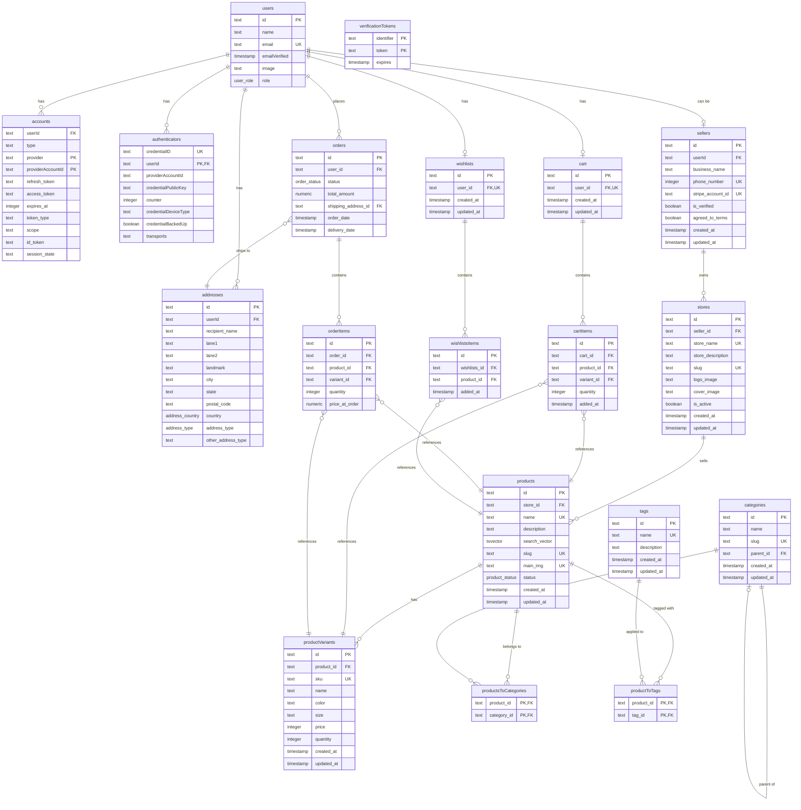

# Database Schema - ER Diagram

This document provides a visual representation of the e-commerce database schema using a Mermaid ER diagram.

## Entity Relationship Diagram

## Table Descriptions

### User & Authentication
| Table | Description |
|-------|-------------|
| **users** | Core user table with basic profile info and role (Buyer/Seller) |
| **accounts** | OAuth provider accounts linked to users (Auth.js adapter) |
| **verificationTokens** | Tokens for email verification |
| **authenticators** | WebAuthn/passkey authentication credentials |

### Addresses
| Table | Description |
|-------|-------------|
| **addresses** | User shipping/billing addresses with type (Home/Work/Other) |

### Seller & Stores
| Table | Description |
|-------|-------------|
| **sellers** | Seller profiles linked to users, includes Stripe account info |
| **stores** | Individual stores owned by sellers |

### Products
| Table | Description |
|-------|-------------|
| **products** | Main product listings with search vector for full-text search |
| **productVariants** | Product variations (size, color, etc.) with pricing and stock |
| **categories** | Hierarchical product categories (self-referencing for subcategories) |
| **tags** | Product tags for additional categorization |
| **productsToCategories** | Many-to-many junction table for products ↔ categories |
| **productToTags** | Many-to-many junction table for products ↔ tags |

### Cart
| Table | Description |
|-------|-------------|
| **cart** | Shopping cart (one per user) |
| **cartItems** | Items in the cart with product/variant references and quantity |

### Orders
| Table | Description |
|-------|-------------|
| **orders** | Placed orders with status and shipping info |
| **orderItems** | Individual items in an order with price snapshot at order time |

### Wishlists
| Table | Description |
|-------|-------------|
| **wishlists** | User wishlists (one per user) |
| **wishlistsItems** | Products saved to wishlist |

## Enums

| Enum | Values |
|------|--------|
| **user_role** | `Seller`, `Buyer` |
| **address_type** | `Home`, `Work`, `Other` |
| **address_country** | `India`, `United States` |
| **product_status** | `draft`, `active`, `archived` |
| **order_status** | `PENDING`, `PROCESSING`, `SHIPPED`, `DELIVERED` |
