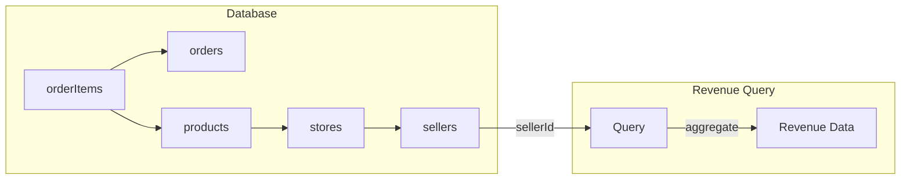

# Understanding the Seller

Before jumping into implementation, let's think about what a seller actually cares about when viewing their dashboard.

## What Does a Seller Want to See?

A seller's primary concerns revolve around understanding how their business is performing. The key questions on their mind:

1. **"How much money am I making?"** – Revenue is king. Sellers want to see earnings at a glance.
2. **"What's selling well?"** – Identifying top-performing products helps with inventory and marketing decisions.
3. **"How are my sales trending?"** – Growth over time matters; sellers want to spot patterns.
4. **"What orders need attention?"** – Recent order activity helps manage fulfillment.

## Sales vs Revenue: What's the Difference?

| Term | Definition | Example |
|------|-----------|---------|
| **Sales** | The *number of transactions* or *units sold* | "I made 50 sales this month" (50 orders) |
| **Revenue** | The *total money earned* from those sales | "I earned ₹25,000 this month" |

In short:
- **Sales** = Count (volume of orders or items)
- **Revenue** = Money (sum of earnings)

A seller could have high sales but low revenue (many small orders) or low sales but high revenue (fewer, expensive orders). Both metrics matter for different insights.

## Key Metrics a Seller Cares About

1. **Total Revenue** – How much money earned overall
2. **Total Sales/Orders** – Volume of transactions
3. **Average Order Value (AOV)** – Revenue ÷ Orders – helps understand customer spending behavior
4. **Top Selling Products** – Which products are driving the business
5. **Revenue Trends** – Chart of earnings over time (daily, weekly, monthly)
6. **Recent Orders** – Quick view of latest activity

## MVP Prioritization for E-Commerce Marketplace

For an MVP, we need to focus on what's **essential** for sellers to start using the platform vs what can be added later.

### ✅ Must-Have (MVP Scope)

| Feature | Why It's Essential |
|---------|-------------------|
| **Total Revenue** | Sellers won't trust a platform that can't show them earnings |
| **Total Orders Count** | Basic volume metric; answers "am I getting sales?" |
| **Recent Orders List** | Sellers need to see activity and manage fulfillment |
| **Top Selling Products** | Helps sellers understand what's working |

### ⏳ Nice-to-Have (Post-MVP)

| Feature | Why It Can Wait |
|---------|-----------------|
| **Revenue Trends (Charts)** | Useful but requires enough historical data to be meaningful |
| **Average Order Value** | Calculated metric; nice insight but not critical for launch |
| **Period Comparisons** | "This month vs last month" – needs history |
| **Export/Download Reports** | Power feature for established sellers |

### 🔮 Future Scope

- **Profit Margins** – Requires cost tracking (not just revenue)
- **Customer Insights** – Repeat buyers, demographics
- **Inventory Alerts** – Low stock warnings based on sales velocity
- **Payout Tracking** – When marketplace handles payouts

### MVP Focus Summary

```
┌─────────────────────────────────────┐
│         SELLER DASHBOARD MVP        │
├─────────────────────────────────────┤
│  💰 Total Revenue (all-time/month)  │
│  📦 Total Orders                    │
│  🏆 Top 5 Selling Products          │
│  🕐 Last 10 Recent Orders           │
└─────────────────────────────────────┘
```

> [!IMPORTANT]
> For MVP, keep queries simple. Avoid complex date aggregations until we have real usage data and seller feedback.

---

# Seller Dashboard Revenue Feature

Implement server actions to retrieve and aggregate revenue/sales data for sellers to display on their dashboard.

## Data Flow



The query chain: `sellers` → `stores` → `products` → `orderItems` → `orders`

---

## Proposed Changes

### [MODIFY] [revenue.ts](file:///Users/ashutoshhota/Coding/projects/web/ecom/src/actions/(seller)/dashboard/revenue.ts)

Implement the following server actions:

#### 1. `getSellerRevenueSummary()`
Returns high-level revenue metrics for the authenticated seller.

```typescript
interface RevenueSummary {
  totalRevenue: number;          // All-time revenue
  totalOrders: number;           // Total order count
  averageOrderValue: number;     // totalRevenue / totalOrders
  itemsSold: number;             // Total quantity sold
}
```

#### 2. `getRevenueByPeriod(period: 'day' | 'week' | 'month' | 'year')`
Returns revenue data grouped by time period for charts.

```typescript
interface PeriodRevenue {
  period: string;    // e.g., "2026-02-07" or "2026-W06" or "2026-02"
  revenue: number;
  orders: number;
}
```

#### 3. `getTopSellingProducts(limit?: number)`
Returns the seller's best-performing products.

```typescript
interface TopProduct {
  productId: string;
  productName: string;
  totalQuantity: number;
  totalRevenue: number;
}
```

#### 4. `getRecentOrders(limit?: number)`
Returns recent orders containing the seller's products.

```typescript
interface RecentOrder {
  orderId: string;
  orderDate: Date;
  status: string;
  items: {
    productName: string;
    variantName: string;
    quantity: number;
    priceAtOrder: number;
  }[];
  orderTotal: number;  // Total for seller's items only
}
```

---

## Query Strategy

### Base Query Pattern
All queries will follow this join pattern:

```
orderItems 
  → products (via productId) 
    → stores (via storeId) 
      → sellers (via sellerId)
  → orders (via orderId)
```

### Authentication Flow
1. Get session via `auth()`
2. Lookup seller record by `userId`
3. Get all stores owned by seller
4. Query order items for products in those stores

---

## Implementation Details

### Helper: `getSellerStoreIds()`
A reusable helper to get all store IDs for the authenticated seller:

```typescript
async function getSellerStoreIds(userId: string): Promise<string[]>
```

### SQL Aggregations
- Use Drizzle's `sql` template for aggregations (`SUM`, `COUNT`, `AVG`)
- Use `DATE_TRUNC` for period grouping
- Filter by `orders.status` to optionally exclude pending/cancelled orders

---

## Verification Plan

### Manual Testing
1. Create test orders with products from a seller's store
2. Call each action and verify returned data matches expected calculations
3. Test edge cases: seller with no orders, multiple stores, etc.

### Type Safety
- Ensure all return types are properly defined
- Validate that numeric aggregations handle null/empty cases
